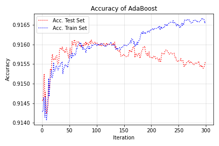

# Project UniBo
Collection of various Decision Tree Algorithms to analyze data with an unbalanced class distribution with *Python 3.8*. To conquer the problem a variety of Boosting Algorithms as well as Under and Over Sampling will be tested and used.

## Table of Contents
- [Project UniBo](#project-unibo)
  - [Table of Contents](#table-of-contents)
  - [Requirements](#requirements)
  - [Introduction and Dataset](#introduction-and-dataset)
  - [First Implementations](#first-implementations)
    - [Cross Validation](#cross-validation)
  - [Boosting Algorithms](#boosting-algorithms)
  - [Over Sampling](#over-sampling)
  - [Under Sampling](#under-sampling)
  - [Results](#results)

## Requirements
Clone the Git repository

    $ git clone https://github.com/RobinPelkner/ProjectUniBo

Load the required dependecies via 

    $ cd ProjectUniBo/ 
    $ conda env create -f environment.yml 
    $ conda activate python3-env 

Most of the project is written in a Jupyter Notebook for the purpose of better manipulation of the code since it is possible to run the code piece by piece.

## Introduction and Dataset
This projects aims to analyse a dataset matching various health features to the patients having a heart disease. The data was taken in 2020 by the Center of Disease Control and Prevention [CDC](https://www.cdc.gov/heartdisease/) and features a lot of various health indicators of the patients. In this project a simplified version of this dataset will be used, which can be found [here](https://www.kaggle.com/datasets/kamilpytlak/personal-key-indicators-of-heart-disease).

This simplified version consists of 18 columns. Since a lot of the used algorithms can only use numerical values for analysis the data needs to be prepped. Also, the data needs to be checked for missing values and incomplete data in general. This process is done with the python script `data_prep.py`. In general, **No** is replaced with 0, while **Yes** is replaced with 1.Furthermore, the preparated data is saved for future usage in `heart_prep.py`.
Here is an overview of the feature columnds and there numerical values:
- *HeartDisease:* Determines wether the patient has a heart disease or not.
- *BMI:* numerical Body Mass Index
- *Smoking*, *AlcoholDrinking* and *Stroke:* Wether patients smoke/drink alcohol/had a stroke
- *PhysicalHealth* and *MentalHealth:* Number of days in the last 30 days with physical/mental health issues
- *DiffWalking:* Wether patients have problems walking and climbing stairs
- *Sex:* The medical sex of the patient; **Female**: 0, **Male**: 1
- *AgeCategory:* number from 0 to 12 indicate increasing age category. Youngest patients are 18
- *Race:* etnicity of the patients in numbers from 0 to 5
- *Diabetic*, *PhysicalActivity*, *Asthma* and *SkinCancer:* wether patients have one of those illnesses and wether they are physically active
- *GenHealth:* number from 0 to 4 indicating general, self evaluated health 
- *SleepTime:* average hours of sleep per 24h circle

Aim of this analysis is to find those indicators which make a heart disease most likely. In total there are 319795 valid patient entries, but only 27373 of them actually have a heart disease, which makes this a highly unbalanced class. 

    

Other classes with a lot of imbalance are *Stroke*, the previous illnesses and *AlcoholDrinking*,whereas *Sex*, *Race* and *AgeCategory* seem to be fairly balanced.

## First Implementations
All implementations are done in `dtc_comp.ipynb`. This project uses a variety of Decision Tree Classifier and algorithms that depend on them. Most of the algorithms are provided by the python package [scikit-learn](https://scikit-learn.org/stable/index.html). Decision Trees are machine learning algorithms which cut the data based on the given classes. The given dataset is randomly splitted into training and test dataset in the ratio 3:2. The learning structure takes the form of a tree, where the class labels are leaves and the actual values are the branches.

 

The Decision Trees are build from the top to the bottom. At each further node the data will be split up that the child nodes are as pure as possible. The so called *loss functions* are a measure for the *impurity* of the dataset and thus has to be minimized by the algorithm. How many cuts in total are made by the algorithm can be set (*max_depth*) to prevent overtraining.

To start off, the standard `DecisionTreeClassifier` (*DTC*) of **scikit-learn** is used. It provides two different criterions:
- The *Entropy* $H$ criterion describes the impurity analogous to the entropy in thermodynamics as disorder. So if there are multiple classes in a node, there is entropy here. It can be definded as  $H = - \sum_{i} p_i \text{log}_2(p_i)$, where $p_i$ is the probability of a class in a node with $N$ classes.
- The *Gini* $G$ criterion measures the frequency at which an element of the dataset will be mislabelled when it is randomly labeled. It is defined as $G = 1 - \sum_{i} p_i^2$.

To evaluate the algorithms scoring parameters will be used. In this project mostly the *accuracy* (ACC) and *recall* (REC) score will be used. They are defined by the parts of *true positive (TP)*, *false positives (FP)*, *true negative (TN)* and *false negative (FN)* results.  The accuracy is definded as $$ \text{ACC} = \frac{TP + TN}{TP + FP + TN +FN} $$ whilethe recall is defined as $$ \text{REC} = \frac{TP}{TN + FP} $$. Furthermore, the *Receiver operating characteristic* (ROC) curve is another used algorithm. It describes the curve of the true positive rate ($TPR = \frac{TP}{TP + FN}$) plotted against the false positive rate ($FPR = \frac{FP}{FP + TN}$). It can be evaluated with the area under the curve (ROC AuC), which is around 0.5 for a random classifier and should therefore be higher than that for a real one.

The *DTCs* have been evaluated with various maximum depth to prevent overtraining and to find the optimal values for both. 

                                                                                                                                                                                                                                                    
                                                                                                                                                                                

As can be seen the accuracy of the test dataset and of the training data set are close to each other for both criterions and `max_depth` below 10. The accuracy is in both cases above 0.9. For `max_depth` above 10, overtraining becomes more and more visible since the curves of the accuracy of the test and the training dataset move away from each other. 
The recall score on the other hand is around 0.1 for the not overtrained area and does not move far above 0.2 at all for both criterions. This indicates a too large false positive rate, triggered by the imbalance in the distribution of Heart Diseases. All of the data is classified as "No Heart Disease". The accuracy is of course still high, since most of the data is actually classified correctly as "No Heart Disease". 

    

Aim of this project is to circumvent this problem in various ways and to find an actually working procedure.

### Cross Validation
Cross Validation is a method of validating the used models. The training dataset gets divided into $k$ subsets. The model gets tested on all $k$ subsets individually after being trained 
on the remaining $k-1$ subsets. This makes the model less susceptible to noise in the data 
and gives a more accurate scoring. In this project the parameter is set to $k=5$ and the evaluation method of **scikit-learn** will be used.

## Boosting Algorithms
To improve the standard DTC one can use *Boosting* to improve the outcome. Boosting algorithms are ensemble methods. They take simple algorithms (*weak learner*) like DTC, iterate them sequentialy based on the weighted iterations before. In the end they return a weighted average  making them a *strong learner*, thus reducing noise, variance and bias. The weighting process itself is dependend on the algorithm. This project will take a look at various Boosting algorithms:
- AdaBoost
- GradientBoosting
- HistGradientBoosting
- CatBoost
- eXtremeGradientBoosting
The first three algorithms are part of **scikit-learn**, while the others can be found here: [CatBoost](https://catboost.ai/), [XGBoost](https://xgboost.readthedocs.io/en/stable/).
The used algorithms base on two different algorithms: Ada Boosting, for which a comprehensive explanation can be found [here](http://www.inf.fu-berlin.de/inst/ag-ki/adaboost4.pdf), while the other four algorithms base on Gradient Boosting. Instead of having a weight function like AdaBoost, Gradient Boosting uses Gradient descent to improve the model. The four Algorithms here are various implementations of this. *HistGradientBoosting* is based on Microsoft's [LightGBM](https://github.com/Microsoft/LightGBM) a high performance Gradient Boosting algorithm. It should also be noted that this instance has an early stop feature to prevent overtraining automatically. *CatBoost* is an alternative Gradient Boosting algorithm by Yandex. *XGBoost* uses an improved loss function instead of only using Gradient Descent, as can be seen [here](https://en.wikipedia.org/wiki/XGBoost#The_algorithm). This algorithm has only limited compatibility with **scikit-learn**.
A test was performed to find an optimal value for the number of iterations ("estimators"). The plots for one algorithm are shown as an example since all algorithms provide similar scores. It can be seen, that the accuracy value is realy stable even for high numbers of estimators, while 
the recall value has improved in comparison to simple DTCs, but is still far away from an acceptable value. The plots shown were made using AdaBoost, the other algorithms produce very similar results.

                                                                                                                         

For all included algorithms crossvalidation is performed for fairly optimal numbers of estimators/depths of trees. The results are included in the table below. It becomes clear that the Boosting algorithms do not improve the overall score by much. All of these recall values are not acceptable for a further analysis.
|           |DTC Entropy|DTC Gini|AdaBoost|GradientBoost|HistGradientB.|CatBoost|XGBoost| 
|---        |---|---|---|---|---|---|---|
|Accuracy   |0.9134 ± 0.0006|0.9123 ± 0.0006|0.9148 ± 0.0012|0.9160 ± 0.0004|0.9157 ± 0.0006|0.9152 ± 0.0007|0.9147 ± 0.0005|
|ROC AuC    |0.8130 ± 0.0035|0.8132 ± 0.0032|0.8377 ± 0.0026|0.8441 ± 0.0020|0.8438 ± 0.0017|0.8430 ± 0.0019|0.8386 ± 0.0019|
|Recall     |0.0768 ± 0.0144|0.0868 ± 0.0148|0.1028 ± 0.0062|0.0941 ± 0.0040|0.0775 ± 0.0067| 0.0865 ± 0.0058|0.0998 ± 0.0029|

## Over Sampling
One method of improving faulty results due to imbalanced classes is the so called Over Sampling. It includes copies of the minority class to the dataset. This is a method usually used when there is not a lot of data available since it makes the training more resource costly. Inclusion of more underrepresented data in combination with boosting algorithms should improve the recall score by a lot. The package [Imbalanced-learn](https://imbalanced-learn.org/stable/index.html) includes many Over Sampling algorithms, three of them will be used in this analysis: The *RandomOverSampler* copies samples at random from the underrepresented class. Apart from that there are two other popular over sampling techniques: *Synthetic Minority Oversampling Technique* (SMOTE) and the *Adaptive Synthetic Sampling Approach* (ADASYN). SMOTE creates synthetic by applying a nearest neigbour algorithm to the original data thus not copying already existing data, but creating similar samples. ADASYN follows a similar approach where synthetic data is generated which is harder to learn for the models thus improving the learning procedure as well; details on this can be found [here](https://ieeexplore.ieee.org/stamp/stamp.jsp?tp=&arnumber=4633969). 

## Under Sampling
Another often used method to improve datasets with imbalanced classes is Under Sampling. Under Sampling is basically the opposite of Over Sampling. Instead of generating more data for the minority class, the majority class gets reduced. This project takes a look at three Under Sampling procedures of the [Imbalanced-learn](https://imbalanced-learn.org/stable/index.html) package. There is the *RandomUnderSampler* which removes samples randomly, the *CondensedNearestNeighbour*, which removes samples based on a kNN algorithm (similar to SMOTE), and *InstanceHardnessThreshold*, which removes samples based on their probability of being classified wrong.

## Results